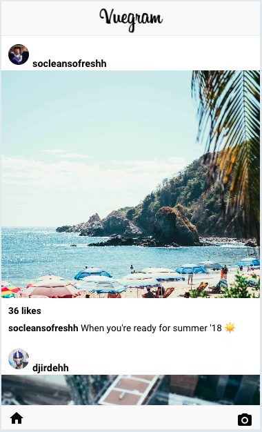
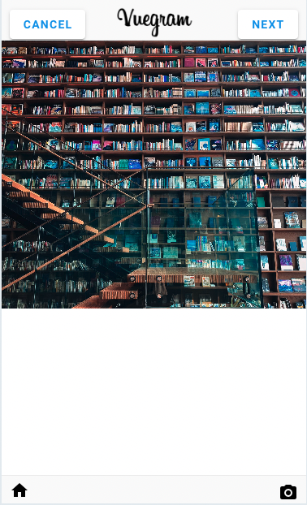
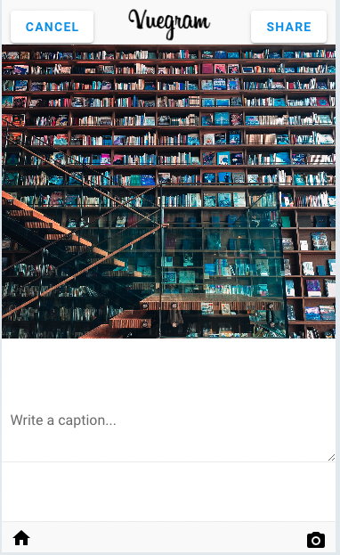

# Instagram Clone with Vue 3
Here's Instagram clone app built with Vue 3, Vuetify 3 !
I was able to get [this source code](https://codesandbox.io/s/8ypo1v7xq2?from-embed) to work in vue3 as well.
<table>
  <thead>
    <th>Homepage</th>
    <th>Select Image</th>
    <th>Input Caption</th>
  </thead>

  <tbody>
    <tr>
      <td>
        
      </td>
      <td>
        
      </td>
      <td>
        
      </td>
    </tr>
  </tbody>
</table>

## Project setup
```
npm install
```

### Compiles and hot-reloads for development
```
npm run serve
```

### Compiles and minifies for production
```
npm run build
```

### Lints and fixes files
```
npm run lint
```

### Customize configuration
See [Configuration Reference](https://cli.vuejs.org/config/).


### npm list
- mdi/font@5.9.55
- vue-router@4.1.6
- vue@3.2.45
- vuetify@3.0.4